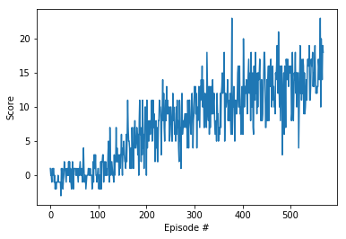

<!-- Latex extension -->

<!-- Main document -->
# Abstract

This project aims to train a reinforcement learning agent to collect yellow bananas and avoid collecting blue bananas. The state, reward and actions available are introduced <a href="./README.md">here</a>.

# Methodology

My agent takes the approach of Deep Reinforcement Learning by utilizing a Deep Neural Network as an function approximator to the true state-action table (or the Q-table) with dimension `STATE_SIZE(37)` x `ACTION_SIZE(4)`.

To make sure my network network can monotonically decrease, I also deploy two important techniques: **Experience Replay**, **Fixed Q-Targets**, along with a simple **Double DQN** optimization.

The task is episodic, so I train the agent to conduct a maximum of **3000** episodes, and for each trial, to prevent the agent from endlessly looping, I set a threshhold of **1000** trials, so each episode terminates whenever `done == True or trials > 1000`.

## Network Architecture

The network consists of 1 **Input Layer**, 2 **Hidden Linear Layers** and 1 **Output Layer**.

### **Input layer**

The input layer is simply the state space, with dimension of **37**.

### **1st Hidden Layer**

The first hidden layer consists of **128** neurons, which constitutes **128 * 37 + 128 = 4864** (including Bias) trainable parameters. 

### **2nd Hidden Layer**

The first hidden layer consists of **64** neurons, which constitutes **128 * 64 + 64 = 8256** (including Bias) trainable parameters.

### ** Output Layer **

The final(output) layer is simply the action space, with dimension **4**, which consititutes **64 * 4 + 4 = 260** (including Bias) trainable parameters.

## Deep Q-Learning

Q-Learning is a type of *Temporal Difference* algorithm that tries to find the optimal State-Action table (or the Q-table); It updates the Q-table at every time step, which is different from the *Monte Carlo* method which has to wait until an episode finishes. 

Q-Learning is also called *Sarsamax*, it is different from the primitive *Sarsa(0)* algorithm in that it tries to perform the update with the most optimal action that results in the maximum reward using our greedy policy, namely:

$$Q(S_t, A_t) \leftarrow Q(S_t, A_t) + \alpha (R_{t+1} + \gamma \bold{\max_a Q(S_{t+1}, a)} - Q(S_t, A_t))$$

Here we are just considering the State-Action relationship as a table, to tackle more realistic scenarios, especially when the underlying state of the environment is unknown (e.g. when you are training an agent to play Atari by looking at the pixels as input), it is rather hard and futile for us now to represent the State-Action relationship as a table; Therefore, we can estimate this relationship using a function approximator like *Deep Neural Network*, hence the name Deep Q-Learning.

## Experience Replay

Consider each *experience* tuple $(S, A, R, S')$, it would be useful if we can train on these experience more than once to gain more relationship within the data, especially by recalling data point that rarely occur, so we can store these experience in a **Replay Buffer** and sample from it for training.

In a naíve Q-Learning algorithm, these experience tuples are trained sequentially, which is susceptible to the strong correlations between each consecutive tuple. Therefore, we instead samnple them uniformly random to ameliorate these correlations. 

## Fixed Q-Targets

Since Q-Learning is a type of **TD Learning**, in its original form, everytime we are trying to optimize the temporal difference, namely:

$$\triangle w = \alpha \cdot (R + \gamma \max_a \hat q(S', a, w)- \hat q(S, A, w)) \triangledown_w \hat q(S, A, w)$$

Note that we are updating our target $w$ while considering $w$ in the update rule, meaning we are using our presumed values to make predictions, which could derail us from the optimal results due to the correlations embedded in each update. 

To tackle this problem, we can introduce another DNN that serves as the *target network*; this new network can have identical structure as the one we use for final prediction, but is updated much less often so that it is different enough for our learning process to break the previously mentioned correlations. 

## Double DQN
To further improve performance, I have also attempted to implement **Double DQN**. It can be triggered by calling `agent.enable_double_DQN()`.

**Double DQN** aims to ameliorate the effect of overestimation for Vanilla DQN. Vanilla DQN uses a randomly initialized Q-table and within the update step:

$$R + \gamma \hat q(S', \argmax_a \hat q(S', a, w), w)$$

It is reusing the $w$ in the evaluation step, and researches have shown that trust $w$ at the initially noisy condition can lead to overestimation of the Q values. 

But with **Double DQN**, we can substitute it with:

$$R + \gamma \hat q(S', \argmax_a \hat q(S', a, w), w^-)$$

where $w^-$ is a different DQN that is used to evaluate the action, since we already have a target DQN used for fixing Q-target. 

So instead of directly piping the `next_states` into the target network, I pipe it into the local network, and use the selected action indexes to pick actions from the target network with a `gather()` call.

# Results

## Rewards Plot

## Test Drive

To evaluate performance, I turn off the `Train=True` parameter in the **OpenAI Gym** environment, and load the `checkpoint.pth` generated with my model and evaluate the scores for 10 rounds, here are the scores:

| 10 | 18 | 19 | 18 | 21 | 20 | 17 | 16 | 13 | 4 |
|---|---|---|---|---|---|---|---|---|---|

Although there's an outlier for the last trial (potentially due to the specificity of that instance of the environment), the other scores seem consistent and promising. 

# Discussion

Double DQN has indeed increased performance, without this technique, my simple model takes **> 2000** episodes before reaching the target score.

Network architecture also matters, I increased the number of neurons in the first linear layer from **64** to **128** because **64** takes **2x** as long to reach the target score, this is probably due to the increased input/state dimension which has increased intricacies of the function approximator.

Another important and yet to be solved problem is that although my Double DQN reaches target score with less episodes, the scores tend to be vacillating, I have tried 3 batches of testing, each with 10 trials, the first two batches contain scores such as **1**, **3**, **5** etc. This situation is not as bad when I trained without DQN for over 1800 episodes. I suspect that it's because our model has not had enough experiences to fully understand the environment.

# Future work

As suggested by the project guideline, we have some other optimization techniques to experiment with:

### Prioritized Experience Replay

Currently we are sampling uniformly from the replay buffer (Experience Replay) for training, but sometimes it is more beneficial to sample from those that are more likely to gain more knowledge. So we can introduce a probability $p_t$ for each replay tuple:
$$p_t = |\delta_t| = |\gamma \max _a \hat q(S_{t+1},a,w) - \hat q(S_t, A_t, w)|$$
However, suppose the TD error is 0, then the probablity to select that tuple would be 0, which prevents us from learning that tuple, so we can add a small amount $\epsilon$ to each $p_t$. Moreover, to reduce the bias associated with priorities when we perform the Q-value updates, we also need to introduce an **Importance Sampling Weight** $\alpha (\frac{1}{N} \cdot \frac{1}{P_i})^b$ to control the weights.

### Dueling DQN

Another intuition for DRL is that most of the states are similar across different trials with some minor variations, to take advantage of this, Dueling DQN uses two streams of networks which share some parts of the DNN but branches off in the final few layers. One branch estimates the state values ($V(s)$) directly and the other branch estimates the **Advantage Values** ($A(s,a)$) which reflects the variation; These 2 values are then combined to form the final Q function. 
