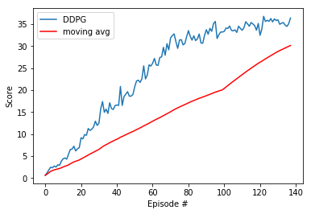

<!-- Latex extension -->
<script type="text/javascript"
        src="https://cdnjs.cloudflare.com/ajax/libs/mathjax/2.7.0/MathJax.js?config=TeX-AMS_CHTML">
</script>
<script type="text/x-mathjax-config">
MathJax.Hub.Config({
tex2jax: {
inlineMath: [['$','$'], ['\\(','\\)']],
processEscapes: true},
jax: ["input/TeX","input/MathML","input/AsciiMath","output/CommonHTML"],
extensions: ["tex2jax.js","mml2jax.js","asciimath2jax.js","MathMenu.js","MathZoom.js","AssistiveMML.js", "[Contrib]/a11y/accessibility-menu.js"],
TeX: {
extensions: ["AMSmath.js","AMSsymbols.js","noErrors.js","noUndefined.js"],
equationNumbers: {
autoNumber: "AMS"
}
}
});
</script>

<!-- Main document -->
# Abstract
Using the **second** version of the environment, this project aims to train a parallel of **20** simulated robot agents to control their arms to move to the correct location, that is visually following the trace of the edge of the spheres.

# Methodology
The agents are trained using the **DDPG** (Deep Deterministic Policy Gradient) algorithm, since I am already gained familiarity with **DQN** and **DDPG** seems like a smooth transition from the concept of the former idea, it is selected as my algorithm.

The implementation of the DDPG agent and network architecture is adapted mostly from this <a href="https://github.com/udacity/deep-reinforcement-learning/tree/master/ddpg-pendulum">base version</a> provided in the nano degree's repo.

## DDPG
Similar to **DQN**, **DDPG** is also deterministic, as in, it generates a deterministic policy that includes a mapping between state and actions, instead of a probability distribution over the actions as seen in other stochastic policy algorithms like **PPO**. It also uses the **DQN** architecture as its individual components, which includes essential things like **Replay Buffer** and **Target Network** which we have discussed in Project 1.

This algorithm is positioned as an **Actor Critic** method by the <a href="https://arxiv.org/pdf/1509.02971.pdf"> DDPG paper</a>, in that it also uses 2 DNNs (Deep Neural Networks) to approximate the optimal policy. However, instead of using the Critic network as the baseline, it uses it as to approximate the maximizer for $\argmax_a Q^*(s,a)$ by evaluating the Q value the "best" action chosen by the Actor network, namely $Q(s, \mu(s; \theta_\mu; \theta_Q))$. This approach is to help solve the problem that traditional DQN is ineffective at handling large, continuous action space as we have here because $\argmax_a Q^*(s,a)$ is generally impossible to achieve.

The above, however, is a general summary of the algorithm for **DPG**` (Deterministic Policy Gradient), the authors for **DDPG** also adds the following modification to help mitigate the unstability of the original algorithm:
- Use a Replay Buffer as in DQN to increase randomness in training data.
- Use *soft update* to update the target networks rather than copying the weights directly as in DQN. This makes the training a lot slower because weight changes for target networks are much less radical, but it is proved to beneift learning.

## Network Architecture
I have experimented with several versions of the network architecture and here's the one I selected in the end (for more details, please see `model.py`):

### Actor Network

#### Input layer
The input layer contains *33* x *1024* linear units, *33* is the state size.

#### First layer
The first layer is a batched normalization layer that is suggested by the <a href="https://arxiv.org/pdf/1509.02971.pdf"> DDPG paper</a> to "minimize covariance shift during training".

#### Second layer
The second layer contains *1024* x *256* linear units.

#### Output layer
The output layer contains *256* x *4* linear units, *4* is the action size. Note that the final layer is activated using a $tanh()$ function to generate continous value. 

### Critic Network

#### Input layer
The input layer contains *33* x *256* linear units, *33* is the state size.

#### First layer
The first layer is also a batched normalization layer that is suggested by the <a href="https://arxiv.org/pdf/1509.02971.pdf"> DDPG paper</a> to "minimize covariance shift during training".

#### Second layer
The second layer contains *256+4=260* x *128* linear units, *4* is the action size which is concatenated to incorporate the evaluation of action values.

#### Output layer
The output layer contains *128* x *1* linear units, which is just the single value score for the Actor's chosen action as described in the **DDPG** section.

## Ornstein-Uhlenbeck Process
It is also interesting to discover that the sample DDPG agent utilized the **OU** process, which is another big difference from vanilla DQN.

As described in the paper mentioned previous, this process add *temporarily correlated* noises to each action value to increase exploration efficiency for physical control problems.

## Hyperparameters
The list of hyperparamters are listed mostly in the `ddpg_agent.py` file, here are they:

```
BUFFER_SIZE = int(1e5)  # replay buffer size
BATCH_SIZE = 128        # minibatch size
GAMMA = 0.99            # discount factor
TAU = 1e-3              # for soft update of target parameters
LR_ACTOR = 1e-4         # learning rate of the actor
LR_CRITIC = 1e-3        # learning rate of the critic
WEIGHT_DECAY = 0        # L2 weight decay
```

which is pretty much the default values inherited from the sample code, but overall it has been effective overall.

# Results

## Plot (version 2)



# Future Work

I have only considered the **DDPG** algorithm for this project, which is a non-typical Actor-Critic algorithm. There are many other "more typical" different algorithms described in the lectures, such as the **A3C** (Asynchronous Advantage Actor Critic), **A2C** (Advantage Actor Critic) and **GAE** (General Advantage Estimation) that uses the Critic network as baseline.
Moreover, it maybe also beneficial to try some vanilla Policy Gradient methods like **PPO** (Proximal Policy Optimization) or the good old **REINFORCE** algorithm.
