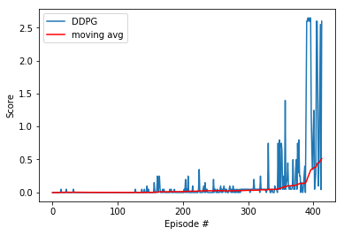

<!-- Latex extension -->
<script type="text/javascript"
        src="https://cdnjs.cloudflare.com/ajax/libs/mathjax/2.7.0/MathJax.js?config=TeX-AMS_CHTML">
</script>
<script type="text/x-mathjax-config">
MathJax.Hub.Config({
tex2jax: {
inlineMath: [['$','$'], ['\\(','\\)']],
processEscapes: true},
jax: ["input/TeX","input/MathML","input/AsciiMath","output/CommonHTML"],
extensions: ["tex2jax.js","mml2jax.js","asciimath2jax.js","MathMenu.js","MathZoom.js","AssistiveMML.js", "[Contrib]/a11y/accessibility-menu.js"],
TeX: {
extensions: ["AMSmath.js","AMSsymbols.js","noErrors.js","noUndefined.js"],
equationNumbers: {
autoNumber: "AMS"
}
}
});
</script>

<!-- Main content -->
# Abstract 
This project aims to coordiante two agents to work *collaboratively*, which is different from the second version of the second version of the previous project where each agent only needs to focus on his own task. 

Specifically in this project, we need to train two agents to play tennis with each other and make sure that the ball does not fall onto the ground.

# Methodology

## (Modified) DDPG
The bulk of the **DDPG** algorithm has been described in the report of the previous project and they are mostly similar. There are a few modifications to the learning process and replay buffer to accomondate for the multi-agent scenario:

- Replay Buffer now contains a flattened version of the state/action space to be fed into the Critic's network.
- The `learn()` function in `ddpg_agent.py` has been modified to fit the modified Replay Buffer's state/action space, and how they are fed into the Critic's network.

## Hyper parameters
Here are the list of **DDPG** learning parameters:

```
BUFFER_SIZE = int(1e6)  # replay buffer size
BATCH_SIZE = 128        # minibatch size
GAMMA = 0.99            # discount factor
TAU = 3e-3              # for soft update of target parameters
LR_ACTOR = 1e-3         # learning rate of the actor
LR_CRITIC = 2e-3        # learning rate of the critic
WEIGHT_DECAY = 0        # L2 weight decay

NUM_AGENTS = 2          # number of agents
```

Most of them are similar to what I used in the previous project. I have tuned the `BATHC_SIZE` and the learning rates for actor and critic a little bit, and ended up using the values shown above. 

As an aside, after I increased `BATCH_SIZE` to **256**, the performance gets worse and training time increases, which is surprising.

## Network architecture

### Actor network

#### Input layer
The input layer contains *24* x *128* linear units, *24* is the state size.
*128* seems to be the optimal number of neurons after experimented with *96*, *128* and *256*.

#### First layer
The first layer is a batched normalization layer that is suggested by the <a href="https://arxiv.org/pdf/1509.02971.pdf"> DDPG paper</a> to "minimize covariance shift during training".

#### Second layer
The second layer contains *128* x *128* linear units.

#### Third layer
The third layer is also a batched normalization layer that is added for faster training, and experimentation shows that it does not seem to impact score performance.

#### Output layer
The output layer contains *256* x *4* linear units, *4* is the action size. Note that the final layer is activated using a $tanh()$ function to generate continous value. 

### Critic network

#### Input layer
The input layer contains *48* x *256* linear units, *48* is the state size for *both agents combined*, the state vector is flattened and fed to the critic so it allows evaluation of both agent's states.

#### First layer
The first layer is also a batched normalization layer that is suggested by the <a href="https://arxiv.org/pdf/1509.02971.pdf"> DDPG paper</a> to "minimize covariance shift during training".

#### Second layer
The second layer contains *128+4=260* x *128* linear units, *4* is the action size for *both agents combined*, the action vector is also flattened and fed to the critic so it allows evaluation of both agent's actions.

#### Output layer
The output layer contains *128* x *1* linear units, which is just the single value score for the Actor's chosen action in the construct of the **DDPG** algorithm.

# Discussion

The major challenging part of this project is to figure out flattening the state and action space for the Critic to evaluate the *collaborative* performance of both agents and alter the learning process and architecture to use that idea. Before making these changes, the Critic was only able to see individual agent's performance (state/actors) because the input vectors are not convolved, and the scores peeked at a much lower value (~0.3).

# Results



The model starts to gain traction after ~300 episodes, maxes out ~550-650 episodes and starts to decrease after that, forming a bellman curve.

# Future work
Similar to the previous project, we can try out other algorithms like the **A3C** (Asynchronous Advantage Actor Critic), **A2C** (Advantage Actor Critic) and **GAE** (General Advantage Estimation) that instead of DDPG.
Moreover, it maybe also beneficial to try some vanilla Policy Gradient methods like **PPO** (Proximal Policy Optimization) or the good old **REINFORCE** algorithm.
